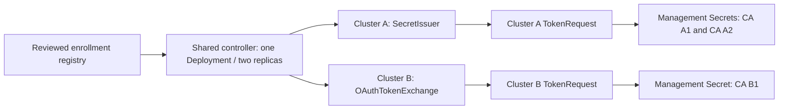

# Shared Kubernetes TokenRequestor specification

Version: draft 0.1. Status: shared runtime and experimental paired chart/image implemented;
complete failure, OAuth API-trust and production acceptance remain pending.
MUST / MUST NOT define release requirements. Proposed defaults are subject to measured acceptance.

## 1. Goals, scope and topology

REQ-01: ONE controller Deployment MUST serve multiple workload clusters and multiple CA consumers
per cluster. Two replicas and one elected leader provide HA; enrollment MUST NOT add another
controller Deployment, CronJob, sidecar or child-local agent.

REQ-02: Authentication MUST be selectable per workload cluster. A service instance MAY mix
SecretIssuer and OAuthTokenExchange enrollments. No implicit discovery, wildcard enrollment,
admin-kubeconfig adoption or automatic RBAC provisioning is permitted.

REQ-03: Credential acquisition, short-lived CA token issuance and Secret publication MUST be
separate steps. Human OIDC login and a Fleet-style API gateway are separate projects. Tokens
for people MUST NOT be repurposed for this workload. The design MUST NOT require a particular
OIDC/access-platform product, secret broker, company network, CAPI provider or chart framework.

REQ-04: The controller MUST NOT change workers, control planes, MachineDeployments, Machines,
cluster templates, CAPI resources, storage, or CA discovery/min/max/scale-down policies.
Several node pools do not require several CAs. Operators MUST prevent overlapping CA discovery
sets when enrolling multiple CAs for one workload cluster.



## 2. Credential-provider boundary

REQ-05: Use a small internal Go interface, not a runtime plugin ABI:

```go
// Acquire returns a bearer credential for issuing tokens on one enrolled API.
type IssuerProvider interface {
    Acquire(ctx context.Context, target IssuerTarget) (IssuerCredential, error)
}
```

IssuerTarget is immutable validated enrollment metadata. IssuerCredential contains only a
bearer value, optional expiry (absent ONLY for explicit long-lived SecretIssuer), and expected
principal. Endpoint/CA trust are pinned enrollment fields; providers MUST NOT return arbitrary
redirected API targets, exec commands, TLS bypass flags or general kubeconfigs.
The interface is bearer-only in v1. A platform returning mTLS certificates requires a reviewed
contract extension, not undocumented conversion to a token. It is not a generic OIDC adapter.

Controller-owned lifetime scheduling, credential validation, TokenRequest and publication are
shared. SecretIssuer's long-lived material is replaced by the operator's rotation workflow;
OAuthTokenExchange refresh means reacquiring via exchange, not renewing a CA JWT in place.
Provider errors MUST be classified as retryable transport/rate-limit, configuration/trust,
authentication/authorization or bootstrap-required. Response bodies MUST NOT enter errors.
Trust bundles MUST contain only valid `CERTIFICATE` PEM blocks separated by whitespace.
Reject private keys, PEM headers, malformed certificates and unrelated leading/trailing content
before acquisition or copying trust bytes into consumer Secrets.

### 2.1 SecretIssuer

REQ-06: Read only a pinned management Secret (type Opaque, exact keys `ca.crt`, `token`). Pin
Secret UID, public CA hash and workload-cluster kube-system UID. Long-lived tokens MUST be
explicitly declared; short-lived source tokens MAY be used but this provider MUST NOT pretend
to keep them alive. This service does not self-renew source issuer tokens in v1.

The issuer is a dedicated ServiceAccount distinct from every CA consumer. Its authority is only
named `serviceaccounts/token` creation for enrolled CA SAs plus required identity checks.
It MUST NOT issue for itself or arbitrary SAs, manage RBAC, read application Secrets, modify
Nodes or use cluster-admin. Replacing the issuer MUST retain the pinned Secret UID using CAS.
The source carries `token-requestor.io/rotated-at` (RFC3339). Missing/future/overdue rotation
metadata fails acquisition. Default rotation policy is 90 days, owned by the enrolling operator;
policy compliance MUST be
tracked independently of token expiry. A manually created long-lived SA token is not automatically
rotated and does not expire by design. Platform credential policy may require a shorter period.

### 2.2 OAuthTokenExchange profile

REQ-07: Implement RFC 8693 as an explicit machine profile, not browser authorization-code login,
device login, password grant or a stored user refresh token. Only HTTPS token endpoints are allowed.

| Request property | v1 contract |
| --- | --- |
| grant_type | `urn:ietf:params:oauth:grant-type:token-exchange` |
| subject_token | Freshly read projected management ServiceAccount JWT |
| subject_token_type | `urn:ietf:params:oauth:token-type:jwt` |
| requested_token_type | `urn:ietf:params:oauth:token-type:access_token` |
| audience | Exact reviewed workload-API audience |
| scope | Explicit configured set; no implicit admin scope; response scope must match the configured set |
| client authentication | `client_secret_basic` from a pinned Secret; no inline credentials |
| response | access_token, token_type Bearer, issued_token_type access_token, positive expires_in |

Token exchange MUST use form encoding, bounded bodies (64 KiB), timeouts, TLS validation and no
redirects. Reject duplicate JSON keys, missing/wrong types, unexpected token types, invalid or
excessive lifetime, error responses and malformed bearer values. No URL/query credential transport.
Trust Secret keys are exactly `ca.crt` (broker TLS) and `api-ca.crt` (pinned workload API trust);
the client Secret contains exactly `client-secret`. Client secrets MUST NOT be sent to discovery/JWKS
endpoints or logged. Basic auth is only for the
pinned token endpoint. The subject JWT is reread on each exchange; never cached past expiry. Authentication-failure
caching MUST include its current private fingerprint so a new projected JWT can be evaluated
without an unrelated Secret mutation. Automatic subject rotation MUST NOT bypass a broker
Retry-After deadline; keep that budget bound to the reviewed registry/Secret inputs.
Use projected-volume JWT with a dedicated broker audience; it is not the default API token.
Its mount path MUST match an explicitly rendered volume, with no subPath or arbitrary file reads.

A successful RFC response does not prove Kubernetes acceptance. The workload API MUST be
configured to trust the returned credential, and the authenticated principal MUST have the exact
issuer RoleBinding. In the OIDC/JWT API-server case, issuer URL, verification keys, audience,
username prefix, groups mapping and algorithms must be independently reviewed. An opaque token
requires another approved API authenticator; v1 accepts only JWT access tokens to limit scope.
OIDC support alone does not guarantee this profile; product integration needs its own matrix row.
Discovery validation alone is not proof of issuance, authorization or recovery.

Both subject/client authentication and exchange-token lifetime are provider-specific trust inputs.
The broker MUST independently authenticate management's projected token (issuer, keys, audience,
subject) and MUST NOT trust a claimed cluster ID supplied by the controller. Configure each target
with separate authorization; never request broad audiences as a compatibility workaround.

Acquire early, accounting for clock skew and issued expiry. No OAuth refresh-token persistence,
unauthenticated mode or silent fallback to SecretIssuer. Client-secret expiry/rotation/revocation
and management issuer signing-key changes require documented recovery; exchange does not eliminate
all bootstrap dependencies. Future private_key_jwt or other grants require explicit extensions.

## 3. Enrollment registry

REQ-08: One named ConfigMap holds versioned non-secret JSON. Platform operators own it through
GitOps; the controller has read-only access. Typed decoding rejects unknown/duplicate fields,
missing required values, unsupported schema, invalid UUIDs, duplicate targets and documents >1 MiB.
CLI `validate-config` reads stdin and uses the same validation. Registry/consumer IDs, namespaces
and volume names use DNS labels (63 characters); Kubernetes object names allow DNS subdomains
(253 characters). v1 bounds enrollments to 100 clusters and 100 consumers per cluster.
The example is synthetic and disabled, not applyable.

Global fields: schemaVersion, managementUID and clusters[]. Cluster fields:

- id, enabled, endpoint (HTTPS with explicit numeric port; no userinfo/query/fragment),
  kubeSystemUID and caSHA256.
- identityNamespace; provider discriminated config (`SecretIssuer` OR `OAuthTokenExchange`).
- expected issuer username/groups; named identity checks; exact TokenRequest audiences.
- lifetime: requestedSeconds, acceptedMinSeconds, acceptedMaxSeconds, renewBeforeSeconds,
  stopBeforeSeconds and clockSkewSeconds. Positive, internally ordered and bounded.
- consumers[]: unique id/enabled, child SA name/UID, management Secret namespace/name/UID,
  CA Deployment namespace/name/UID/imageDigest, reloadPolicy and approved permission profile.

Provider union: SecretIssuer includes issuer SA name/UID and Secret ref. OAuthTokenExchange
includes tokenEndpoint, TLS trust Secret ref, clientID/clientSecret ref, projected subject token
volume name/audience, requested audience/scope and accepted issuer-credential TTL bounds.
All refs carry namespace/name/UID; referenced Secret values never appear in registry data.
CA public trust is pinned; OAuth issuer verification/expiry is authenticated against the API,
not trusted merely because JWT claims decode correctly.

Output Secrets MUST preexist, be mutable Opaque and have exactly `ca.crt`, `token` keys. They
MUST match pinned UIDs and ownership IDs. Issuer/client/TLS refs MUST NOT collide with outputs;
no two enrollments may own the same output or duplicate a consumer SA identity.
A SecretIssuer source is dedicated to one workload cluster and cannot double as an OAuth source. Distinct CAs
receive distinct tokens; the controller does not fan out one JWT. Missing/mismatched objects
require operator action, not automatic creation/adoption.

Default proposed CA TTL: request 24h, accept 22h to 25h, refresh before 12h remaining, stop at
30m remaining, skew allowance 60s. Enforce TTL > refresh > stop, sufficient time for calls and
reload, and actual expiration. These values are rollout defaults, not tested guarantees.

Registry is polled by named GET every 30s. Validate an entire snapshot before switching its
configuration hash/generation, cancel/drain superseded work and recheck generation before writes.
Invalid new config freezes new issuance/publication, reports ConfigRejected and keeps safety
protection for the last accepted consumers. Intent updates and concurrent writes are not an
atomic multi-resource transaction; documented enrollment/suspension workflow is required.
Disabling a consumer drains issuance but retains expiry protection while CA is still running.
Removal requires explicit suspend/drain/revoke steps; it never garbage-collects identities.

## 4. Permissions and trust

REQ-09: One management SA holds the UNION of all enrolled permissions. Compromise affects all
enrolled identities. Namespaced Roles restrict unrelated resources but do not isolate the shared
process. Separate trust domains require separate installations; multi-cluster does not imply
mixing production and nonproduction credentials. v1 supports one management API per installation.

| Location | Minimal authority |
| --- | --- |
| Controller namespace | GET named registry; GET/UPDATE named status CM and precreated Lease |
| Management identity | GET named kube-system Namespace |
| Enrolled namespace | GET named issuer/provider Secrets; GET/PATCH named outputs only |
| CA namespace | GET named Deployment and /scale; PATCH named /scale for guarded stop/restart |
| Child identity namespace | CREATE named SA /token; GET enrolled SAs |
| Child identity guard | GET named kube-system Namespace; own SelfSubjectReview/AccessReview |
| Child CA consumer | Approved CA read/events profile and named UID guard; never token issuance |

RBAC MUST NOT grant Secret list/watch/create/delete, broad resource create, impersonation,
TokenReview of arbitrary users, RBAC mutation, bind/escalate, wildcard TokenRequest, or CAPI writes.
Named Roles bind the shared management SA explicitly. Precreate runtime Lease/status/output
resources outside the controller; no top-level create grant is required. Permissions added to
workload clusters are dedicated resources, not edits to shared roles/controllers/CRDs.

Authenticate candidate issuer/consumer with SelfSubjectReview and check expected username/groups;
verify SA UID by named GET and token claims, target UID by authenticated GET and required/denied
rights by SSAR. Supplemental JWT parsing is NOT signature/authentication verification. Reject
unexpected privileged groups; OIDC principal mappings are configured and separate from SA subjects.
Static YAML and fake clients cannot prove real RBAC subresource-name restrictions.

REQ-10: Pin endpoints, TLS trust/SAN and expected identities. Disallow insecure TLS, redirects,
environment proxies, arbitrary exec/auth providers and token logging. Egress allowlists must cover
only management, enrolled APIs and broker endpoints. No admin credential fallback. Use encrypted
management Secret storage, restricted backups and credential-safe audit policy. Management local
credentials use the kubelet-rotated projected SA token. Store remote credentials only in approved
Secrets/process memory, never temporary workspace files, CLI arguments, status or metrics.

## 5. Reconciliation, concurrency and durability

REQ-11: Use client-go leader election with one precreated Lease: duration 30s, renew 20s, retry 5s.
Cancel calls and terminate on leadership loss; release only after workers drain. Two replicas on
different nodes, PDB minAvailable 1, termination budget 45s. Leader election does not provide strict
fencing. Duplicate token issuance during partitions is allowed; credential corruption is not.

Use one rate-limiting queue entry per cluster, one in-flight reconcile per cluster and initially
four workers. Remote clients and auth caches are isolated per cluster; management QPS 10/burst 20,
remote QPS 2/burst 4. Process at most four consumers per slice, then requeue so one large/broken
cluster cannot starve others. Consumer failures have independent backoff. API calls 10s, slice 60s,
backoff 5s..5m with jitter and 429 Retry-After. Deadline-sensitive work gets priority without
unbounded concurrency. Clock jumps/skew, cancellation and shutdown need tests.

REQ-12: A pass MUST:

1. Verify management UID, accepted generation, leadership and named local objects.
2. Acquire issuer through the target provider. Validate authenticated identity, target UID,
   issuer rights and pinned SA UIDs. A valid issuer can rescue an expired CA consumer.
3. Request a new token for each due consumer with exact audiences/TTL; validate the API response,
   candidate's authenticated identity, actual lifetime and allowed/denied CA permissions.
4. CAS output Secret with UID and resourceVersion JSONPatch tests; update only token and owned
   non-secret annotations. Re-read on conflict. Candidate expiration must improve stored expiry;
   never blindly retry stale patches or roll back to an older token.
5. Verify committed UID, trust, generation and data by in-memory readback; record sanitized status.
6. Reload/validate that consumer by its configured policy; schedule from actual expiry with jitter.

SecretIssuer has no source-credential mutation: long-lived issuer remains operator-managed.
OAuth issuer credentials can be reacquired after controller restart and need not be persisted.
Only validated CA tokens are durable output. Crash before publication leaves existing output;
crash between consumers retries incomplete ones without stopping healthy consumers. Leadership
and config cancellation plus CAS/lifetime ordering are required; exact-once is not promised.
Go does not guarantee complete in-memory secret zeroization; clear material best-effort.

## 6. CA lifecycle and failures

REQ-13: `TokenFile` updates normal Secret directory mounts; never env/subPath. Normal renewal
MUST NOT restart CA. Acceptance requires the same CA Pod UID and successful authenticated API
activity after the OLD token expires, for two real rotations on the accepted CA binary.

`StopStart` is the explicit compatibility policy. Persist per-consumer restart intent (operation
ID, config generation, Deployment UID, initial replicas, candidate expiry) in the named status CM
BEFORE stopping. Only an approved running singleton can be stopped/restarted. CAS /scale UID/RV,
wait for actual Deployment status replicas zero, publish/readback, then resume only matching intent.
If intent persistence fails, do not stop. Recovery revalidates candidate expiry and identity.
Never start an already stopped CA. Exclude HPA/other scale writers and require suspension before
manual intervention: RV cannot reveal manual intent when replicas remain the same.

REQ-14: Transient failures retain running CA while its token is valid with safety margin. Without
validated replacement by stop-before, stop ONLY the named affected CA through guarded /scale.
Latch emergency stops; operator acknowledgement and healthy replacement are required to resume.
Stopped requestor cannot enforce this guard; independent monitoring/on-call must cover service loss.
Management outage may prevent stop confirmation: report StopUnconfirmed, not a guaranteed stop.
Never shrink existing workers as recovery. BootstrapRequired/auth rejection is distinct from
network backoff; no endless expired-credential retry or provider fallback.

Long-lived issuer revocation/replacement is operator-controlled; workload/API signing-key/SA changes
can invalidate it despite no scheduled expiry. OAuth mode depends on broker/client/subject trust
availability. HA reduces process failure, not shared management/child/broker outage. On-call drills
must cover each bootstrap dependency before enabling that provider.

## 7. Helm, monitoring, releases and non-goals

REQ-15: One dedicated Helm chart MUST package controller, service/SA, explicit named Roles/Bindings,
registry/status CM, Lease, PDB, NetworkPolicy and optional ServiceMonitor/PrometheusRule. Defaults
are replicas 0, no targets and monitoring CR generation disabled. Approval enables replicas 2.
No CRDs installed by this chart. Render monitor CRs only when explicitly enabled and APIs exist.
Chart renders management resources only; separate opt-in bootstrap templates are applied to each
workload API by an approved operator, never by a Helm hook/cross-cluster script.

No inline values credentials, SA token Secret creation, admin kubeconfig, live hooks, automatic
CA enrollment or automatic activation. Chart must preserve runtime status/Lease state during
upgrade: precreated empty skeletons carry no rendered data/spec fields for runtime-owned state,
and upgrade/uninstall semantics must be tested. Referenced issuer/output Secrets are external,
never chart-owned. Helm upgrade is not issuer rotation.

REQ-16: Monitoring and response procedures are required for production activation; exported
metrics alone are insufficient. See [operations](operations.md). Monitor missing controller,
issuer rotation policy, OAuth dependencies, failures, expiry and stop confirmation.

REQ-17: Versioned image, OCI chart, config schema and accepted compatibility evidence MUST be
released together through GitHub/GHCR. See [release contract](releases.md). No production label
without matrix evidence; no product-agnostic OIDC claim from mock protocol tests.

Non-goals: user OIDC login, interactive kubeconfig delivery, API gateway/reverse tunnels, generic
secret management, autoscaling algorithms, certificates-as-output, admin RBAC provisioning,
child agents, SaaS dependencies, runtime plugins and automatic provider fallback.

## References

- [Kubernetes authentication](https://kubernetes.io/docs/reference/access-authn-authz/authentication/)
- [ServiceAccount credential recommendations](https://kubernetes.io/docs/concepts/security/service-accounts/)
- [Named RBAC resources/subresources](https://kubernetes.io/docs/reference/access-authn-authz/rbac/)
- [Leader election fencing limitation](https://pkg.go.dev/k8s.io/client-go/tools/leaderelection)
- [RFC 8693 Token Exchange](https://www.rfc-editor.org/rfc/rfc8693.html)
